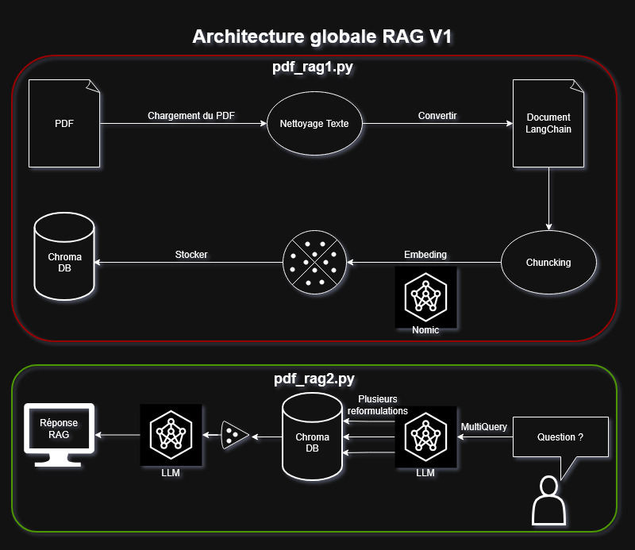
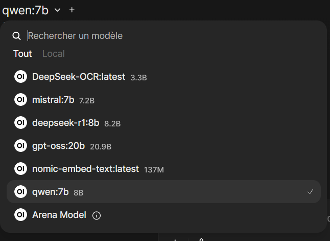

# RAG PDF -- Version 1

Retrieval Augmented Generation sur documents PDF\
Extraction → Vectorisation → Recherche → Génération de réponse via LLM
(Qwen/Ollama)

------------------------------------------------------------------------

## Fonctionnalités principales (V1)
   -Extraction du texte depuis un PDF via PyPDF2.\
   -Découpage du texte en chunks avec LangChain.\
   -Génération d'embeddings via Ollama (`nomic-embed-text`).\
   -Stockage dans une base vectorielle ChromaDB.\
   -Recherche contextuelle améliorable avec MultiQueryRetriever.\
   -Génération de réponses via Qwen:7B (Ollama).\
   -Base vectorielle persistée sera créer et stocker dans `./vector_db`.  

  

------------------------------------------------------------------------

# Notice d'utilisation

## Prérequis

<u>Avoir installé :</u>

   Docker + Docker Compose
   Python 3.10+<br>
Ollama n’a pas besoin d’être installé sur votre PC  
-Il sera démarré dans un conteneur Docker via `docker-compose`

<u>Télécharger les modèles locaux :</u>


Via Open WebUI -> http://localhost:3001/

Dans l'onglet rechercher un modèle en haut a gauche.



Le modéle a télécharger et utilisé est qwen7b.

------------------------------------------------------------------------

## Installer les dépendances Python


``` bash
pip install -r requirements.txt
```

------------------------------------------------------------------------

## Ajouter vos PDF

Le fichier PDF doit être placés dans :

    ./data/

Exemple :

    data/
     └── these_meteo.pdf

------------------------------------------------------------------------

## Lancement via Docker Compose

Assurez-vous que votre fichier `docker-compose.yml` est présent à la
racine du projet, puis lancez :

``` bash
docker compose up -d
```

Cela démarre l'environnement, l'API Ollama et la base vectorielle.

------------------------------------------------------------------------

## Ingestion et création de la base vectorielle

Lancez le script d'ingestion :

`pdf_rag1.py`


Ce script :  
1. charge le PDF
2. en extrait le texte
3. découpe le texte en chunks
4. génère les embeddings
5. stocke le tout dans `./vector_db`

------------------------------------------------------------------------

## Poser une question au RAG

Lancez le script RAG :

`pdf_rag2.py`

Ce script :
1. charge la base vectorielle.  
2. Reformule la question (MultiQueryRetriever).  
3. Récupère les chunks pertinents.
4. Puis génère une réponse via Qwen:7B

------------------------------------------------------------------------

# Structure du projet

    .
    ├── data/
    │   └── simulation_sonars.pdf
    ├── vector_db/
    │   └── ... (base Chroma persistée)
    ├── pdf_rag1.py        # Ingestion & vectorisation
    ├── pdf_rag2.py        # RAG : question/réponse
    ├── requirements.txt
    └── docker-compose.yml

------------------------------------------------------------------------

# Limitations connues (V1)

-Un seul PDF traité\
-Pas d'OCR → pipeline aveugle pour les images & scans\
-Métadonnées minimales (pas encore filename, page, type, etc.)\
-Une seule collection vectorielle simple\
-Pas d'interface graphique\
-Pas de contrôle d'accès\
-Pas de monitoring ou logs avancés
